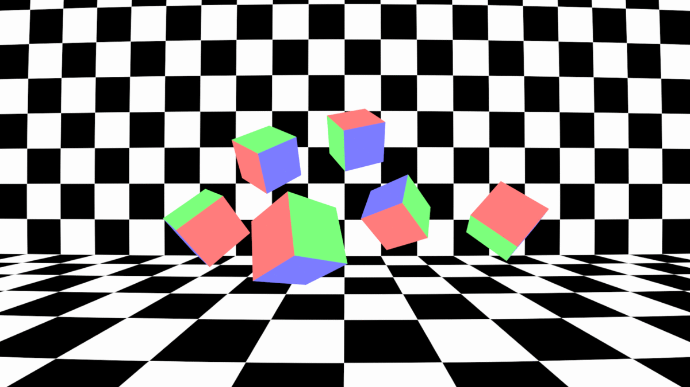
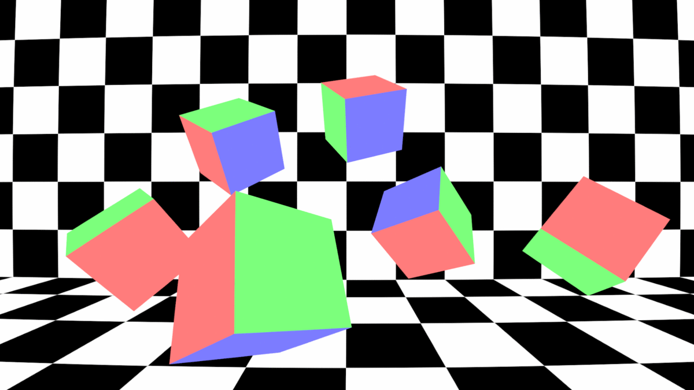

## Dynamic Distortion Example

## Info

### Linear Focal Length Curve
> 
1. Film Back: 36 X 20.25 mm
1. Focal Length : 15mm(Frame 1), 30mm(Frame 60)
1. Distortion
    - Model: 3DE Classic LD Model
    - Parameters:
        1. Distortion: 0.0500(Frame 1), -0.0500(Frame 60)
        1. Anamorphic Squeeze, Curvature XY, Quartic Distortion: Default

### Non-Linear Focal Length Curve
> 
1. Film Back: 36 X 20.25 mm
1. Focal Length : 15mm(Frame 1), 18mm(Frame 30), 30mm(Frame 60)
1. Distortion
    - Model: 3DE Classic LD Model
    - Parameters:
        1. Distortion: 0.0500(Frame 1), 0.0250(Frame 30), -0.0500(Frame 60)
        1. Anamorphic Squeeze, Curvature XY, Quartic Distortion: Default

### Dolly Zoom
> 
1. Film Back: 36 X 20.25 mm
1. Focal Length : 15mm(Frame 1), 18mm(Frame 30), 30mm(Frame 60)
1. Distortion
    - Model: 3DE Classic LD Model
    - Parameters:
        1. Distortion: 0.0500(Frame 1), 0.0250(Frame 30), -0.0500(Frame 60)
        1. Anamorphic Squeeze, Curvature XY, Quartic Distortion: Default
